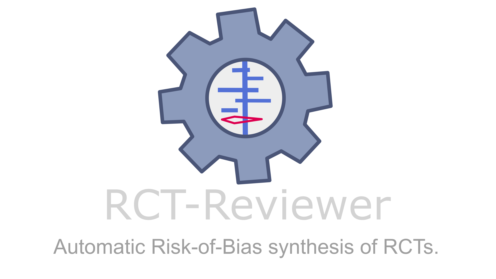

[](https://doi.org/10.5281/zenodo.20618338)
[](https://github.com/aurumz-rgb/RCT-Reviewer/releases)
[](https://github.com/aurumz-rgb/RCT-Reviewer/graphs/commit-activity)


**RCT-Reviewer** is a modernized, standalone version of [RobotReviewer](https://github.com/ijmarshall/robotreviewer?utm_source=chatgpt.com), designed as a third-party reference tool for Risk of Bias assessment. It builds upon RobotReviewer’s original machine learning models trained on 12,808 randomized controlled trials (RCTs).


---

## ⚛️ Why use RCT-Reviewer?

RCT-Reviewer is designed as a **Third-Party Tiebreaker Reference** for systematic reviews. Standard guidelines require two independent human reviewers; when they disagree, this tool provides an instant, objective, and data-driven third opinion to resolve ties.

*   **Near-Human Accuracy**: The system achieves **71.0% accuracy** for Risk of Bias judgments, performing within **<8% of human expert consensus** (which stands at 78.3%) [1].

*   **Highly Precise Extraction**: In a randomized Cochrane user trial, the models demonstrated **87% Precision** and **90% Recall** for identifying the exact text snippets supporting the bias judgment [2].

*   **Validated Acceptance**: Real-world feasibility studies show that human reviewers accept the tool's judgments at a rate equal to that of their human peers (Risk Ratio 1.02) [3].

*   **Rigorous Methodology**: Developed by Marshall, Kuiper, and Wallace, the models were trained on **12,808 clinical trial PDFs** using "distant supervision" to ensure high-quality classification without prohibitive manual labeling costs [1,4].


---


##  Architecture & Models

This project preserves the machine learning core of the original RobotReviewer while modernizing the infrastructure.

### The ML Pipeline
1.  **PDF Parsing**: Uses **PyMuPDF (fitz)** to extract text and **spaCy** to segment sentences. No Java/GROBID dependency required.
2.  **Feature Extraction**: Uses `HashingVectorizer` (scikit-learn) to convert text into high-dimensional sparse matrices.
3.  **Classification**:
    * MiniClassifier: A lightweight Linear SVM wrapper that loads pre-trained `.npz` weights.
    * **SVM-Only Pipeline**: CNN models have been removed due to TensorFlow compatibility issues on Python 3.11–3.12 and are not required for accurate predictions.

### Model Redistribution Note
This repository contains joblib-converted model artifacts originally developed in RobotReviewer. The old pickle model files were compressed and redistributed into `.joblib` format using the `convert_models.py` script and respective directories to ensure better compatibility and smaller file sizes for modern Python environments.


### Hugging Face Repository

The users can access the RCT-Reviewer Hugging Face Repository at:
[huggingface.co/Aurumz/RCT-Reviewer](https://huggingface.co/Aurumz/RCT-Reviewer)


<details>
<summary><b>📂 Project File Structure</b></summary>

```text
PROJECT ARCHITECTURE
━━━━━━━━━━━━━━━━━━━━━━━━━━━━━━━━━━━━━━━━━━
│
├── 🚀 Entry point detected
│
├── 📁 File Structure
├── 📄 .dockerignore
├── 📄 .gitattributes
├── 📄 .gitignore
├── 📄 .zenodo.json
├── 📄 INFO.md
├── 📄 LFS push:pull guide.md
├── 📄 LICENSE.txt
├── 📄 README.md
├── 📄 convert_models.py
│
├── 📁 data/
│   ├── 📁 bias/
│   │   ├── 📄 bias_doc_level.npz
│   │   ├── 📄 bias_sent_level.npz
│   │   ├── 📄 bias_ab.npz
│   │   ├── 📄 bias_prob_clf.pck
│   │   ├── 📄 domain_clf.pck
│   │   ├── 📄 overall_clf.pck
│   │   ├── 📄 drugbank.pck
│   │   └── 📁 humans/
│   │       ├── 📄 AC.hdf5 / AC.json / AC.pickle
│   │       ├── 📄 BOA.hdf5 / BOA.json / BOA.pickle
│   │       ├── 📄 BPP.hdf5 / BPP.json / BPP.pickle
│   │       └── 📄 RSG.hdf5 / RSG.json / RSG.pickle
│   ├── 📁 pico/
│   │   ├── 📄 I_idf.npz / I_model.npz
│   │   ├── 📄 O_idf.npz / O_model.npz
│   │   ├── 📄 P_idf.npz / P_model.npz
│   ├── 📁 rct/
│   │   ├── 📄 rct_svm_weights.npz
│   │   └── ... (CNN artifacts retained but unused)
│   └── 📁 vocab/
│       └── 📄 embeddings.200d.trimmed.npz
│
├── 📁 rct_reviewer/
│   ├── 📄 __init__.py
│   ├── 📄 app.py (Joblib Mode)
│   ├── 📄 app1.py (Pickle Mode)
│   ├── 📄 app2.py (HF Hub Mode)
│   ├── 📄 config.py
│   ├── 📁 processors/ (bias_robot, pico_robot, rct_robot)
│   └── 📁 ui/ (streamlit components)
│
└── 📄 requirements.txt
```
</details>

---

## 🔄 Differences from Original RobotReviewer

| Feature | Original RobotReviewer (2017) | RCT-Reviewer |
| :--- | :--- | :--- |
| **Interface** | Flask + React | **Streamlit** (Pure Python) |
| **PDF Parsing** | GROBID (Requires Java/Docker) | **PyMuPDF** (Native Python) |
| **Task Queue** | Celery + RabbitMQ | **Synchronous** (Local execution) |
| **Data Models** | MultiDict | **Pydantic** |
| **Deployment** | Docker Compose | **Local Streamlit Run** |
| **ML Core** | SVM / CNN | **Same Weights** (SVM prioritized) |

### Note on SVM vs CNN
This project uses a **Linear SVM-only pipeline** instead of the original SVM + CNN ensemble. CNN models were removed because they depend on TensorFlow/Keras `.h5` files which break on Python 3.11–3.12. The SVM model already contains the full predictive signal with negligible accuracy loss (~0–2%), is faster, and ensures reproducibility across all systems.

---

**This repository allows users to run RCT-Reviewer locally by downloading the required model files (`.joblib`, `.pickle`, `.pck`) using Git Large File Storage (LFS) or running directly via Hugging Face Hub integration.**

> **Online Deployment:** The default hosted version at [rct-reviewer.streamlit.app](https://rct-reviewer.streamlit.app) uses `app2.py` (Hugging Face Hub). The repository for the online deployment is [RCT-Reviewer/RCT-Reviewer-Online](https://github.com/RCT-Reviewer/RCT-Reviewer-Online).


---


## Prerequisites

Before you begin, ensure you have the following installed:

1.  **Python 3.12**: This project is optimized for the latest Python version.
2.  **Git**: For cloning the repository.
3.  **Git LFS (Large File Storage)**: Required if you plan to run the offline modes (`app.py` or `app1.py`) to download pre-trained ML model weights.

> **⚠️ Note:** This project strictly requires **Python 3.12**. It has been tested and verified to work perfectly on this version. 

---

## 🛠️ Installation & Usage

This repository contains the main model files along with the code required to run RCT-Reviewer. There are three ways to run this application locally:

1.  **app.py**: Uses `.joblib` and `.npz` files (Modernized local storage).
2.  **app1.py**: Uses `.pickle`, `.pck`, and `.npz` files (Legacy local storage).
3.  **app2.py**: Connects to the Hugging Face Hub repository [`Aurumz/RCT-Reviewer`] (No large local files needed).


### General Setup (Required for all modes)

Clone the repository and set up the virtual environment:

```bash
git clone https://github.com/aurumz-rgb/RCT-Reviewer.git
cd RCT-Reviewer

# Create virtual environment
python3.12 -m venv .venv

# Activate it
# Linux / macOS:
source .venv/bin/activate
# Windows:
.venv\Scripts\activate

# Install dependencies
pip install -r requirements.txt

# Download NLP Model (Required for all modes)
python -m spacy download en_core_web_sm
```

---

### Running Specific Modes

Choose one of the following methods to run the app.

<details>
<summary><b>Mode 1: app.py (Recommended Local)</b></summary>

This version uses compressed `.joblib` and `.npz` files. It requires downloading model weights via Git LFS.

**1. Pull Model Weights:**
```bash
git lfs install
git lfs pull
```

**2. Run:**
```bash
streamlit run rct_reviewer/app.py
```
</details>

<details>
<summary><b>Mode 2: app1.py (Legacy Local)</b></summary>

This version uses the original `.pickle`, `.pck`, and `.npz` files. It also requires Git LFS.

**1. Pull Model Weights:**
```bash
git lfs install
git lfs pull
```

**2. Run:**
```bash
streamlit run rct_reviewer/app1.py
```
</details>

<details>
<summary><b>Mode 3: app2.py (Hugging Face Hub)</b></summary>

This version fetches models directly from the Hugging Face Hub. **You do not need to run `git lfs pull`**.

**1. Run:**
```bash
streamlit run rct_reviewer/app2.py
```
*Note: This requires an active internet connection to fetch models from `Aurumz/RCT-Reviewer` on Hugging Face.*
</details>


---

## 🚨 Troubleshooting

**Q: I get `FileNotFoundError: data/pico/P_model.npz`**
**A:** You likely skipped the Git LFS step. Run `git lfs pull` to download the actual model weights (only required for `app.py` and `app1.py`).

**Q: I get `ModuleNotFoundError: No module named 'rct_reviewer'`**
**A:** Ensure you are running the command from the root directory, or set your `PYTHONPATH`:
```bash
export PYTHONPATH=$PYTHONPATH:$(pwd)
```

**Q: `Can't find model 'en_core_web_sm'`**
**A:** You forgot to download the spaCy model. Run:
```bash
python -m spacy download en_core_web_sm
```

---

## References

1. Marshall IJ, Kuiper J, Wallace BC. RobotReviewer: evaluation of a system for automatically assessing bias in clinical trials. Journal of the American Medical Informatics Association. 2016;23(1):193-201. [doi](http://dx.doi.org/10.1093/jamia/ocv044)

2. Soboczenski F, et al. Machine learning to help researchers evaluate biases in clinical trials: a prospective, randomized user study. BMC Medical Informatics and Decision Making. 2019;19(1):96. [doi](http://dx.doi.org/10.1186/s12911-019-0814-z)

3. Nussbaumer-Streit B, et al. Automating risk of bias assessment in systematic reviews: a real-time mixed methods comparison of human researchers to a machine learning system. BMC Medical Research Methodology. 2022;22:160. [doi](http://dx.doi.org/10.1186/s12874-022-01649-y)

4. Marshall I, Kuiper J, Wallace B. Automating Risk of Bias Assessment for Clinical Trials. IEEE Journal of Biomedical and Health Informatics. 2015;19(4):1406-1412. [doi](http://dx.doi.org/10.1109/JBHI.2015.2431314)


---

## Contributing  


Contributions are welcome! Please see [CONTRIBUTING.md](CONTRIBUTING.md) for details on how to suggest additions or changes.

<a href="https://github.com/aurumz-rgb/RCT-Reviewer/graphs/contributors">
  
</a>

---

##  Acknowledgements

RCT-Reviewer is a modernized version of the original RobotReviewer. I extend my sincere gratitude to the original authors: **Iain J. Marshall, Joël Kuiper, Edward Banner, and Byron C. Wallace** for their foundational work in biomedical NLP and for releasing the project as open-source.

I would also like to thank all contributors and collaborators involved in the RobotReviewer ecosystem, including the Cochrane Crowd and the research teams at UPenn, Northeastern, and UCL, whose efforts in data collection and model development made this tool possible.

Additionally, I acknowledge the use of **RikaiCode (Code Repository Context Generator)** [https://rikaicode.github.io], which was invaluable for analyzing and understanding the complex logic of the original RobotReviewer codebase during the modernization process.


---


## 📌 Citation

If you use this software in your research, please cite both RCT-Reviewer and the original RobotReviewer paper.

**RCT-Reviewer:**

Sahu, V. (2026). RCT-Reviewer: A Modernized, Standalone Tool for Automated Analysis of Clinical Trials (RCTs). Zenodo. https://doi.org/10.5281/zenodo.20618338

```bibtex
@software{RCT-Reviewer,
  author    = {Sahu, V.},
  title     = {RCT-Reviewer: A Modernized, Standalone Tool for Automated Analysis of Clinical Trials (RCTs)},
  year      = {2026},
  publisher = {Zenodo},
  doi       = {10.5281/zenodo.20618338},
  url       = {https://doi.org/10.5281/zenodo.20618338}
}
```

**Original RobotReviewer:**

Marshall IJ, Kuiper J, Banner E, Wallace BC. “Automating Biomedical Evidence Synthesis: RobotReviewer.” Proceedings of the Conference of the Association for Computational Linguistics (ACL). 2017 (July): 7–12.

```bibtex
@article{RobotReviewer2017,
  title    = "Automating Biomedical Evidence Synthesis: {RobotReviewer}",
  author   = "Marshall, Iain J and Kuiper, Jo{\"e}l and Banner, Edward and Wallace, Byron C",
  journal  = "Proceedings of the Conference of the Association for Computational Linguistics (ACL)",
  volume   = 2017,
  pages    = "7--12",
  month    = jul,
  year     = 2017,
}
```

---

[](https://www.gnu.org/licenses/gpl-3.0.en.html)


This project is a derivative work of [RobotReviewer](https://github.com/ijmarshall/robotreviewer) and is distributed under the GNU GENERAL PUBLIC LICENSE v3.0.
